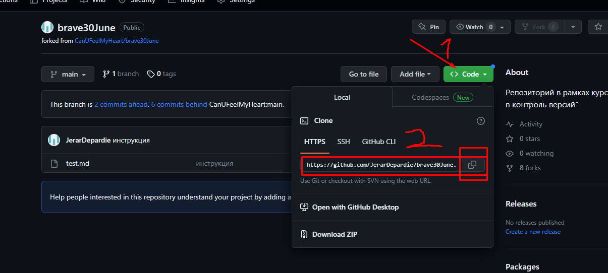

# Знакомство с GitHub-ом 

# Инструкция по гитхабу

Для того что бы получить доступ к удаленному вепозиторию, котороый не пренадлежит нам. Нужно выполнить несколько действий:

1. Выбрапть открытый проект на [GitHub](https://github.com/JerarDepardie/brave30June), и нажать на кнопку "Fork" 

2. Нажать на кнопку "code", и далее скопировать ссылку. 

3. В VS code, открыть терминал и вписать данную команду 
> git clone **"ссылка которую мы скопировали на сайте"** (без кавычек)

 Все готово, теперь можно работать и вносить правки в проект.

 Как только вы все сделаете, нужно **ОБЯЗАТЕЛЬНО** закомитить файл.

 > git add .  
 > git commit -m 'ready'

 Далее можно отправить готовую версию на сайт, командой:

 > git push

 Так же если одновременно с вами над этим проектом работают другие люди, или в удаленном репозитории произошли изменения, после того как вы сделали клон на ваш локальный компьютер, можно использовать следующую команду для того что бы репозиторий обнавился до последней верии.

 > git pull

 ## Предложениена обработку

 На GitHub-е если вы работали над чужим проектом можно предложить ваш вариат.  
 После того как вы сделали все выше перечисленное, на странице репозитория, можно отправить его владельцу. Если ему понравить то что вы сделали, он примит ваше ревью и оно станет оснавным. Если же нет. То нет.  
 Так же после того как вы отправили запрос, каждый раз когда вы вписываете в терминале "git push" автоматически отправляется еще один запрос.
